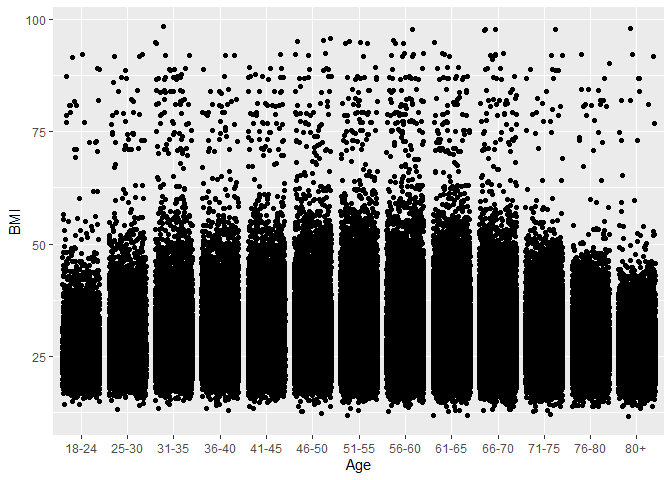

Project 3
================
Jasmine Gallaway and Keren Vivas
2023-10-30

``` r
library(readr)  
library(dplyr)  
```

    ## 
    ## Attaching package: 'dplyr'

    ## The following objects are masked from 'package:stats':
    ## 
    ##     filter, lag

    ## The following objects are masked from 'package:base':
    ## 
    ##     intersect, setdiff, setequal, union

``` r
library(ggplot2)  
library(caret)  
```

    ## Loading required package: lattice

``` r
#readin data  
diabetes_data <- read_csv("diabetes_binary_health_indicators_BRFSS2015.csv")  
```

    ## Rows: 253680 Columns: 22

    ## ── Column specification ────────────────────────────────────────────────────────
    ## Delimiter: ","
    ## dbl (22): Diabetes_binary, HighBP, HighChol, CholCheck, BMI, Smoker, Stroke,...
    ## 
    ## ℹ Use `spec()` to retrieve the full column specification for this data.
    ## ℹ Specify the column types or set `show_col_types = FALSE` to quiet this message.

``` r
#making a tibble
diabetes_data <- as_tibble(diabetes_data)  

#changing diabetes_binary to factor  
diabetes_data$Diabetes_binary <- diabetes_data$Diabetes_binary %>% 
  factor(levels = c(0,1,2),
         labels = c("No Diabetes", "Prediabetes", "Diabetes"))  

#combine education levels one and two  
diabetes_data$Education <- diabetes_data$Education %>% 
  factor(levels = c(1,2,3,4,5,6), 
            labels = c("None/Elementary", "None/Elementary", "Some High School", "High School Graduate", "Some College", "College Graduate"))  

#changing sex to factor  
diabetes_data$Sex <- diabetes_data$Sex %>% 
  factor(levels = c(0,1),
         labels = c("female", "male"))  

#changing age to factor  
diabetes_data$Age <- diabetes_data$Age %>% 
  factor(levels = c(1,2,3,4,5,6,7,8,9,10,11,12,13),
         labels = c("18-24", "25-30", "31-35", "36-40", "41-45", "46-50", "51-55", "56-60", "61-65", "66-70", "71-75", "76-80", "80+"))  
```

``` r
#gathering summary statistics  
sum_data <- diabetes_data %>% 
  summarize(mean = mean(BMI),
            sd = sd(BMI),
            min = min(BMI),
            max = max(BMI),
            IQR = IQR(BMI))  
#printing out  
print(sum_data)  
```

    ## # A tibble: 1 × 5
    ##    mean    sd   min   max   IQR
    ##   <dbl> <dbl> <dbl> <dbl> <dbl>
    ## 1  28.4  6.61    12    98     7

``` r
#boxplot to visualize the summary values  
sum_plot1 <- ggplot(diabetes_data, aes(x = Age, y = BMI)) + 
  geom_jitter()  

sum_plot1  
```

<!-- -->

``` r
#contingency tables
```
