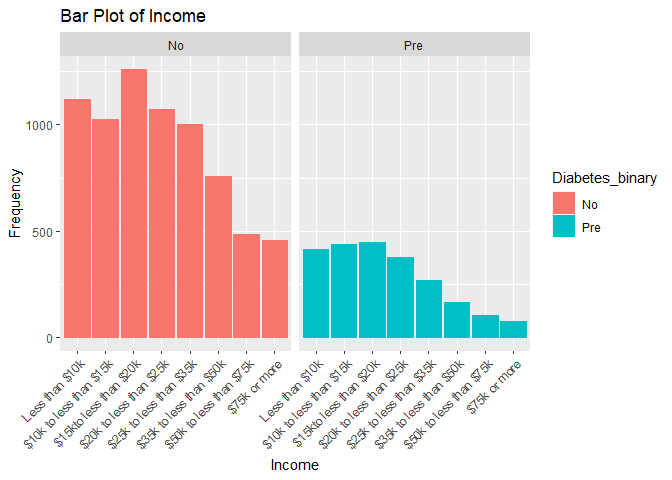

Project 3
================
Jasmine Gallaway and Keren Vivas
2023-10-30

\#`{r setup, include=FALSE} #knitr::opts_chunk$set(echo = TRUE) #` \# 1.
Introduction section

The data analyzed in this report is derived from the Diabetes Health
Indicators Dataset, which was gathered through the Behavioral Risk
Factor Surveillance System (BRFSS) in the year 2015. The BRFSS is an
annual health-related telephone survey conducted by the Centers for
Disease Control and Prevention (CDC). This dataset encompasses a
substantial collection of over 200,000 survey responses, featuring 21
distinct variables or factors, along with a pivotal response variable
termed “Diabetes_binary.” This response variable comprises three
discrete levels:

0 = No diabetes or diabetes only during pregnancy. 1 = Prediabetes. 2 =
Established diabetes.

The dataset encompasses a diverse array of variables that cover a wide
spectrum of information, including the current diabetes status of the
survey respondents, various demographic details, physical and mental
health metrics, dietary habits, and lifestyle factors. The specific
variables selected for analysis in this report are as follows:

- Demographics: This category includes two categorical variables: “Age”
  and “Sex” of the respondents.
- Physical Conditions: These variables encompass “HighBP,” “HighChol,”
  and “HeartDiseaseorAttack.” These are categorical variables, taking
  values of 0 or 1, indicating the presence or absence of high blood
  pressure, high cholesterol, and a history of heart disease or heart
  attacks. Additionally, the “Body Mass Index (BMI)” is included as a
  continuous variable, with values ranging from 12 to 98, providing
  insights into the respondents’ body composition.
- Mental Conditions: The variable “MentHlth” is a continuous variable
  that quantifies the number of days in a month during which the
  respondent’s mental health was not good. It ranges from 1 to 30.
- Diet Conditions: Two categorical variables, “Fruits” and “Veggies,”
  denote whether respondents consume fruits and vegetables one or more
  times per day. These variables take values of 1 (indicating
  consumption) or 0 (indicating non-consumption).
- Habits: This category includes two categorical variables: “Smoker” and
  “PhysActivity.” “Smoker” indicates whether respondents have smoked at
  least 100 cigarettes in their lifetime (with values 1 for yes and 0
  for no), while “PhysActivity” assesses whether respondents have
  engaged in physical activity within the last month (with values 1 for
  yes and 0 for no).

The Exploratory Data Analysis (EDA) of the selected variables is
designed to offer a holistic understanding of the health and lifestyle
characteristics of the survey respondents. This preliminary phase of
analysis helps us uncover patterns within the data.

Subsequently, when we move to modeling the data, our objective is to
delve deeper and gain insights into the intricate ways these factors
impact an individual’s diabetes status. Our analysis will not only
reveal the influence of these factors but also quantify the individual
contributions of each factor to the risk of diabetes.

In the end, the entire analysis will be segmented based on the level of
education. This segmentation enables us to investigate how this specific
demographic factor influences the overall findings. By doing so, we can
discern whether educational levels play a significant role in shaping
the relationship between health, lifestyle, and diabetes risk.

# 2. Required packages section

``` r
library(readr)  
library(dplyr)  
library(ggplot2)  
library(caret) 
library(rmarkdown)
library(purrr)
library(glmnet)
library(randomForest)  
library(gbm) 
library(Metrics)  #For logLoss()  
library(cvms)
library(rpart)  
```

# 3. Data section

``` r
#readin data  
diabetes_data <- read_csv("diabetes_binary_health_indicators_BRFSS2015.csv")  
```

    ## Rows: 253680 Columns: 22
    ## ── Column specification ────────────────────────────────────────────────────────────────────────────────────────────────────────────────────────────
    ## Delimiter: ","
    ## dbl (22): Diabetes_binary, HighBP, HighChol, CholCheck, BMI, Smoker, Stroke, HeartDiseaseorAttack, PhysActivity, Fruits, Veggies, HvyAlcoholCons...
    ## 
    ## ℹ Use `spec()` to retrieve the full column specification for this data.
    ## ℹ Specify the column types or set `show_col_types = FALSE` to quiet this message.

``` r
#making a tibble
diabetes_data <- as_tibble(diabetes_data)  

#changing diabetes_binary to factor  
diabetes_data$Diabetes_binary <- diabetes_data$Diabetes_binary %>% 
  factor(levels = c(0,1),
         labels = c("No","Pre"))  

#combine education levels one and two  
diabetes_data$Education <- diabetes_data$Education %>% 
  factor(levels = c(1,2,3,4,5,6), 
            labels = c("Elementary", "Elementary", "Some_High_School", "High_School_Graduate", "Some_College", "College_Graduate"))  

#changing sex to factor  
diabetes_data$Sex <- diabetes_data$Sex %>% 
  factor(levels = c(0,1),
         labels = c("female", "male"))  

#changing age to factor  
diabetes_data$Age <- diabetes_data$Age %>% 
  factor(levels = c(1,2,3,4,5,6,7,8,9,10,11,12,13),
         labels = c("18-24", "25-30", "31-35", "36-40", "41-45", "46-50", "51-55", "56-60", "61-65", "66-70", "71-75", "76-80", "80+"))  

#Changing fruit to factor  
diabetes_data$Fruits <- diabetes_data$Fruits %>% 
  factor(levels = c(0, 1),
         labels = c("None", "Yes"))  

#Changing physical activity to factor  
diabetes_data$PhysActivity <- diabetes_data$PhysActivity %>% 
  factor(levels = c(0, 1),
         labels = c("None", "Yes"))  

#Changing smoker to factor  
diabetes_data$Smoker <- diabetes_data$Smoker %>% 
  factor(levels = c(0, 1),
         labels = c("No", "Yes"))  

#Changing stroke to factor  
diabetes_data$Stroke <- diabetes_data$Stroke %>%
  factor(levels = c(0, 1),
         labels = c("No", "Yes"))  

#Changing heart disease or attack to factor  
diabetes_data$HeartDiseaseorAttack <- diabetes_data$HeartDiseaseorAttack %>% 
  factor(levels = c(0, 1),
         labels = c("No", "Yes"))  

#Changing veggies to factor  
diabetes_data$Veggies <- diabetes_data$Veggies %>% 
  factor(levels = c(0, 1),
         labels = c("None", "Yes"))  

#Changing Heavy alcohol consumption to factor  
diabetes_data$HvyAlcoholConsump <- diabetes_data$HvyAlcoholConsump %>% 
  factor(levels = c(0, 1),
         labels = c("No", "Yes"))  

#Changing any healthcare to factor  
diabetes_data$AnyHealthcare <- diabetes_data$AnyHealthcare %>% 
  factor(levels = c(0, 1),
         labels = c("No", "Yes"))  

#Changing nodocbcCost to factor  
diabetes_data$NoDocbcCost <- diabetes_data$NoDocbcCost %>% 
  factor(levels = c(0, 1),
         labels = c("No", "Yes"))  

#Changing GenHlth to factor  
diabetes_data$GenHlth <- diabetes_data$GenHlth %>% 
  factor(levels = c(1, 2, 3, 4, 5),
         labels = c("Excellent", "Very Good", "Good", "Fair", "Poor"))  

#Changing DiffWalk to factor  
diabetes_data$DiffWalk <- diabetes_data$DiffWalk %>% 
  factor(levels = c(0, 1),
         labels = c("No", "Yes")) 

#changing HighBP to factor
diabetes_data$HighBP <- diabetes_data$HighBP %>%
  factor(levels = c(0, 1),
         labels = c("No", "Yes"))

#changing HighChol to factor
diabetes_data$HighChol <- diabetes_data$HighChol %>%
  factor(levels = c(0,1),
         labels = c("No", "Yes"))

#changing CholCheck to factor
diabetes_data$CholCheck <- diabetes_data$CholCheck %>%
  factor(levels = c(0,1),
         labels = c("No", "Yes"))

#changing Income to factor
diabetes_data$Income <- diabetes_data$Income %>%
  factor(levels = c(1,2,3,4,5,6,7,8),
         labels = c("Less than $10k", "$10k to less than $15k", "$15kto less than $20k", "$20k to less than $25k", "$25k to less than $35k", "$35k to less than $50k", "$50k to less than $75k", "$75k or more"))
```

Below our data set is subset into the specified education level for the
page.

``` r
# Subset data into a single Education level
subset_data <- diabetes_data %>%
 filter(Education == params$Education)
```

# 4. Summarizations section

Below is some initial exploratory data analysis on the dataset. We began
with looking at group summaries of BMI and mental health. Both are
grouped by the `Diabetes_binary` variable which sorts the participants
into no diabetes, prediabetes, or diabetes.

``` r
#gathering summary statistics of BMI  
sum_data1 <- subset_data %>% 
  group_by(Diabetes_binary) %>%
  summarize(mean = mean(BMI),
            sd = sd(BMI),
            min = min(BMI),
            max = max(BMI),
            IQR = IQR(BMI))  
#printing out  
print(sum_data1)  
```

    ## # A tibble: 2 × 6
    ##   Diabetes_binary  mean    sd   min   max   IQR
    ##   <fct>           <dbl> <dbl> <dbl> <dbl> <dbl>
    ## 1 No               28.8  6.95    13    95     8
    ## 2 Pre              32.4  7.87    15    95    10

``` r
#Summary statistics of mental health 
sum_data2 <- subset_data %>% 
  group_by(Diabetes_binary) %>% 
  summarize(mean = mean(MentHlth),
            sd = sd(MentHlth),
            min = min(MentHlth),
            max = max(MentHlth))  
print(sum_data2)
```

    ## # A tibble: 2 × 5
    ##   Diabetes_binary  mean    sd   min   max
    ##   <fct>           <dbl> <dbl> <dbl> <dbl>
    ## 1 No               5.06  9.62     0    30
    ## 2 Pre              6.14 10.3      0    30

After initial group summaries we then made several contingency tables in
order to observe some of the possible relationships between variables.
Based on these contingency tables we were able to numerically see where
some trends might occur.

## Contingency Tables

``` r
 #1-way contingency table
 one_way_table <- table(subset_data$Fruits)
 one_way_table
```

    ## 
    ## None  Yes 
    ## 4515 4963

``` r
 #2-way contingency table
 two_way_table <- table(subset_data$Smoker, subset_data$HighChol)
 two_way_table
```

    ##      
    ##         No  Yes
    ##   No  1937 1645
    ##   Yes 2804 3092

``` r
 #3-way contingency table
 three_way_table <- table(subset_data$HighBP, subset_data$HighChol, subset_data$HeartDiseaseorAttack)
 three_way_table  
```

    ## , ,  = No
    ## 
    ##      
    ##         No  Yes
    ##   No  2535 1107
    ##   Yes 1741 2477
    ## 
    ## , ,  = Yes
    ## 
    ##      
    ##         No  Yes
    ##   No   171  162
    ##   Yes  294  991

``` r
#4 Contingency table for diabetes_binary vs no doctors visits because of cost  
 tbl_four <- table(subset_data$NoDocbcCost, subset_data$Diabetes_binary)  
 tbl_four
```

    ##      
    ##         No  Pre
    ##   No  6010 1925
    ##   Yes 1172  371

``` r
#5 Contingency table for diabetes_binary vs general health ratings  
 tbl_five <- table(subset_data$GenHlth, subset_data$Diabetes_binary)  
 tbl_five  
```

    ##            
    ##               No  Pre
    ##   Excellent  644   66
    ##   Very Good 1379  194
    ##   Good      2577  656
    ##   Fair      1786  840
    ##   Poor       796  540

``` r
#6 Contingency table for diabetes_binary vs NoDocbcCost vs GenHlth  
 tbl_six <- table(subset_data$GenHlth, subset_data$Diabetes_binary, subset_data$NoDocbcCost)  
 tbl_six
```

    ## , ,  = No
    ## 
    ##            
    ##               No  Pre
    ##   Excellent  598   63
    ##   Very Good 1251  175
    ##   Good      2170  573
    ##   Fair      1397  685
    ##   Poor       594  429
    ## 
    ## , ,  = Yes
    ## 
    ##            
    ##               No  Pre
    ##   Excellent   46    3
    ##   Very Good  128   19
    ##   Good       407   83
    ##   Fair       389  155
    ##   Poor       202  111

We then looked at some additional combinations of variables in graphs to
observe other relationships within the data. In these plots we are
attempting to graph possible relationships between variables. If any
trends are found it could give insight to which variables are important
to use in our predictive modeling.

## Plots

``` r
#Plot 1 is a violin plot that illustrates the distribution of the Mental Health variable across the two sex categories, female and male.

plot1 <- ggplot(subset_data, aes(x = Sex, y = MentHlth)) +
  geom_violin(fill = "lightblue", color = "blue", alpha = 0.7) +
  labs(title = "Mental health condition across gender", x = "Gender", y = "Mental health condition") +
  theme_minimal() 
print(plot1)
```

<!-- -->

``` r
#Plot 2 is a stacked bar plot that depicts the distribution of the Physical Activity variable across all age groups, with each group represented by a different color.

plot2 <- ggplot(data = subset_data, aes(x = Age, y = PhysActivity , fill = Age)) +
  geom_bar(stat = "identity") +
  labs(title = "Stacked Bar Plot of Physical activity days by Age Group", x = "Age Group", y = "Physical activity (days)") +
  theme_minimal()  
print(plot2)
```

<!-- -->

``` r
#Plot 3 is a scatter plot designed to visualize the relationship between the Body Mass Index (BMI) and Mental Health variables, with points colored by sex (female and male)

plot3 <- ggplot(subset_data, aes(x = BMI, y = MentHlth)) +
  geom_point(aes(color = Sex), size = 3) +
  labs(title = "Scatterplot of BMI vs. Mental health", x = "BMI", y = "Mental Health") +
  theme_minimal()  
print(plot3)
```

<!-- -->

``` r
#Plot 4 is a count plot of income versus mental health and color coded by the response variable of Diabetes_binary  
plot4 <- ggplot(subset_data, aes(x = Income, y = MentHlth)) + 
  geom_count(aes(color = Diabetes_binary)) + 
  labs(title = "Count Plot of Income vs. Mental Health", x = "Income", y = "Mental Health") + 
  theme(axis.text.x = element_text(angle = 45, vjust = 1, hjust=1))
print(plot4)
```

<!-- -->

``` r
#Plot 5 is a count plot of income versus physical health and color coded by the response variable of Diabetes_binary  
plot5 <- ggplot(subset_data, aes(x = Income, y = PhysHlth)) + 
  geom_count(aes(color = Diabetes_binary)) + 
  labs(title = "Count Plot of Income vs. Physical Health", x = "Income", y = "Physical Health") + 
  theme(axis.text.x = element_text(angle = 45, vjust = 1, hjust=1))
print(plot5)
```

<!-- -->

``` r
#Plot 6 is a bar plot of diabetes_binary versus mental health used to uncrowd the graphs
plot6 <- ggplot(subset_data, aes(x = MentHlth)) + 
  geom_bar(aes(color = Diabetes_binary, fill = Diabetes_binary)) + 
  facet_wrap(~Diabetes_binary) + 
  labs(title = "Bar Plot of Mental Health", x = "How Many Bad Mental Days", y = "Participant Count") + 
  theme(axis.text.x = element_text(angle = 45, vjust = 1, hjust=1))
print(plot6)  
```

<!-- -->

``` r
#Plot 7 is a bar plot of diabetes_binary versus physical health used to uncrowd the graphs
plot7 <- ggplot(subset_data, aes(x = PhysHlth)) + 
  geom_bar(aes(color = Diabetes_binary, fill = Diabetes_binary)) + 
  facet_wrap(~Diabetes_binary) + 
  labs(title = "Bar Plot of Physical Health", x = "Days Active", y = "Participant Count") + 
  theme(axis.text.x = element_text(angle = 45, vjust = 1, hjust=1))
print(plot7)  
```

<!-- -->

``` r
#Plot 8 is a bar plot of diabetes_binary versus income used to uncrowd the graphs
plot8 <- ggplot(subset_data, aes(x = Income)) + 
  geom_bar(aes(color = Diabetes_binary, fill = Diabetes_binary)) + 
  facet_wrap(~Diabetes_binary) + 
  labs(title = "Bar Plot of Income", x = "Income", y = "Frequency") + 
  theme(axis.text.x = element_text(angle = 45, vjust = 1, hjust=1))
print(plot8)  
```

<!-- -->

# 5. Modeling

Below begins the work to shift into modeling our data. We had some
initial issues with modeling due to our labeling of the variables. We
also had some modeling issues due to there being no recorded responses
of 2 / “Diabetes” within the `Diabetes_binary` dataset. Due to this lack
of response, the “Diabetes” level of `Diabetes_binary` had to be removed
in order for the models to work. The code chunk directly below removes
that factor level. Some of the variables we arbitrarily chose to focus
on in our modeling are Sex, Income, Age, BMI, MentHlth, PhysHlth,
HighBP, Fruits, HvyAlcoholConsump, and NodocbcCost. Variable selection
can be done with penalization modeling such as LASSO.

``` r
#Turning all diabetes responses to NA
#subset_data$Diabetes_binary[subset_data$Diabetes_binary == "Diabetes"] <- NA  

#Dropping level
subset_data$Diabetes_binary <- droplevels(subset_data$Diabetes_binary)  

#Dropping all NA responses
#training <- diabetes_data[complete.cases(diabetes_data),]  

#Setting seed for reproducibility
set.seed(3033)  

#Splitting the data  
intrain <- createDataPartition(y = subset_data$Diabetes_binary, p= 0.7, list = FALSE) 

#Splitting the data
training <- subset_data[intrain,]
testing <- subset_data[-intrain,]  

#Smaller training set for computations  
training <- training[1:250,]
```

## *What log loss is and why we may prefer it to things like accuracy?*

Logarithmic loss is metric used to evaluate how well a model fits. Also
known as cross-entropy loss, log loss is used on binary classification
models where the responses are either 0 or 1. Log loss calculates the
difference between the predicted probabilities and the actual values.
The lower the log loss value, the better the fit of the model is to the
data. Log loss is preferred with this data set because of our focus on
the binary response of diabetes. Our `Diabetes_binary` response variable
has three responses of no diabetes, prediabetes, and diabetes; however,
there seems to be no recorded response of the factor level of 2
(diabetes) within the data so the recorded responses are either 0 or 1.
Log loss is better than accuracy in this case because log loss focuses
on models that predict the class better and penalizes models that are
further from the class.

## *What a LASSO logistic regression model is and why we might try to use this over basic logistic regresion?*

LASSO (Least Absolute Shrinkage and Selection Operator) is a type of
regularized logistic regression. It adds a penalty term to the logistic
regression’s likelihood function to encourage feature selection by
driving some coefficients to exactly zero. This can improve model
interpretability and reduce overfitting and that is why it is used over
the basic logistic regresion.

LASSO logistic regression is a valuable tool when you have
high-dimensional datasets with potentially redundant or irrelevant
features. It can improve model performance, reduce overfitting, and
enhance model interpretability by automatically selecting the most
relevant predictors while eliminating the least important ones. However,
the choice between basic logistic regression and LASSO logistic
regression depends on the specific characteristics of your data and the
goals of your analysis.

## Fit a LASSO logistic regression model and choose the best model

``` r
#Dropping unused level
#training$Diabetes_binary <- droplevels(training$Diabetes_binary)
#testing$Diabetes_binary <- droplevels(testing$Diabetes_binary)

#training <- training[1:250,]

#Setting control for the train control  
control <- trainControl(method = "cv", number = 5, classProbs = TRUE, summaryFunction = mnLogLoss)

#Fitting a LASSO logistic regression model 
model_lasso <- train(Diabetes_binary ~ Sex + Income + Age + BMI + MentHlth + PhysHlth + HighBP + Fruits + HvyAlcoholConsump + NoDocbcCost,
  data = training,
  method = "glmnet",
  trControl =control,
  tuneGrid = expand.grid(alpha = 1, lambda = seq(0.001, 1, length = 100))
)
```

    ## Warning in train.default(x, y, weights = w, ...): The metric "Accuracy" was not in the result set. logLoss will be used instead.

``` r
#Predict
pred_model_lasso <- predict(model_lasso, newdata = testing, type = "prob")

#Turn values into 1's and 0's for the log loss calculation
testing$Diabetes_binary <- ifelse(testing$Diabetes_binary == "No", 0, 1)

# LogLoss function with explicit conversion to numeric
LogLoss <- function(actual, predicted) {
  result <- -1 / length(actual) * sum((actual * log(predicted) + (1 - actual) * log(1 - predicted)))
  return(result)
}

# Calculate log loss on the testing set
test_logloss_lasso <- LogLoss(testing$Diabetes_binary, pred_model_lasso)

test_logloss_lasso
```

    ## [1] 1.604173

``` r
# Display the log loss on the testing set
cat("Log Loss on Testing Set:", test_logloss_lasso, "\n")
```

    ## Log Loss on Testing Set: 1.604173

## *what a classification tree model is and why we might try to use it?*

A classification tree, specifically known as a decision tree for
classification, is a model designed for classifying data. It recursively
divides the input space into regions, assigning a class label to each
region. The decision-making process is visualized as a tree structure,
where internal nodes represent decisions based on specific features,
branches depict the outcomes of those decisions, and leaf nodes contain
the final predicted classes. The construction of a classification tree
involves selecting optimal features to split the data at each internal
node, with the process continuing until a stopping criterion is met,
such as a maximum tree depth or a minimum number of samples in a leaf
node. The tree’s depth and complexity are controlled by different values
of the complexity parameter, typically determined through
cross-validation to select the best parameter.

We might choose to use a classification tree for several reasons. It
offers benefits such as excellent interpretability, no assumption of
linearity, handling of both numeric and non-numeric data, automatic
variable selection, insensitivity to feature scale, robustness to
outliers, suitability for imbalanced data, and its role as a building
block for ensemble methods, enhancing predictive performance.

## Fit a classification tree with varying values for the complexity parameter and choose the best model (best complexity parameter)

``` r
#Set seed for reproducibility
set.seed(123)

# Create 5-fold cross-validation indices
folds <- createFolds(training$Diabetes_binary, k = 5, list = TRUE, returnTrain = FALSE)

# Create a grid of complexity parameter values to try
cp_values <- seq(0.01, 0.1, by = 0.01)

# Create a data frame to store log loss for each complexity parameter
logloss_df <- data.frame(cp = numeric(length(cp_values)), logloss = numeric(length(cp_values)))

# Loop through different complexity parameters
for (i in seq_along(cp_values)) {
  avg_logloss <- 0
  
  # Perform 5-fold cross-validation
  for (fold in seq_along(folds)) {
    # Extract training and validation sets
    training_set <- training[-folds[[fold]], ]
    validation_set <- training[folds[[fold]], ]
    
    # Build the classification tree on the training set
    tree_model <- rpart(Diabetes_binary ~ Sex + Income + Age + BMI + MentHlth + PhysHlth + HighBP + Fruits + HvyAlcoholConsump + NoDocbcCost, data = training_set, method = "class", control = rpart.control(cp = cp_values[i]))
    
    # Make predictions on the validation set
    predictions <- predict(tree_model, newdata = validation_set, type = "prob")[, 2]
    
    # Calculate log loss on the validation set
    fold_logloss <- logLoss(as.numeric(validation_set$Diabetes_binary) - 1, predictions)
    
    avg_logloss <- avg_logloss + fold_logloss
  }
  
  # Calculate average log loss over all folds
  avg_logloss <- avg_logloss / length(folds)
  
  # Store average log loss in the data frame
  logloss_df[i, ] <- c(cp = cp_values[i], logloss = avg_logloss)
}

# Find the best complexity parameter with the minimum average log loss
best_cp <- logloss_df$cp[which.min(logloss_df$logloss)]

# Build the final classification tree with the best complexity parameter
final_tree_model <- rpart(Diabetes_binary ~ Sex + Income + Age + BMI + MentHlth + PhysHlth + HighBP + Fruits + HvyAlcoholConsump + NoDocbcCost, data = training, method = "class", control = rpart.control(cp = best_cp))

# Display the best complexity parameter
cat("Best Complexity Parameter:", best_cp, "\n")
```

    ## Best Complexity Parameter: 0.09

``` r
# Display the final tree
print(final_tree_model)
```

    ## n= 250 
    ## 
    ## node), split, n, loss, yval, (yprob)
    ##       * denotes terminal node
    ## 
    ## 1) root 250 75 No (0.7000000 0.3000000) *

``` r
# Evaluate the final model on the testing set
test_predictions <- predict(final_tree_model, newdata = testing, type = "prob")[, 2]

# Calculate log loss on the testing set
test_logloss_tree <- abs(logLoss(as.numeric(testing$Diabetes_binary) - 1, test_predictions))

# Display the log loss on the testing set
cat("Log Loss on Testing Set:", test_logloss_tree, "\n")
```

    ## Log Loss on Testing Set: 0.2855065

## What a bagged CART model is?

A bagged CART (Bootstrap Aggregating for Classification and Regression
Trees) model is an ensemble machine learning technique aimed at
enhancing predictive model stability and accuracy while mitigating
overfitting. The process involves creating multiple bootstrap samples
from the original dataset by randomly selecting data points with
replacement. Each bootstrap sample is used to train an independent CART
model (decision tree). The predictions from all individual trees are
then combined to form the final ensemble prediction. For classification
tasks, the mode of predictions is often used, while the average is
employed for regression problems. Bagging creates diversity in the
models by training them on different subsets of the data, making the
ensemble more robust and less prone to overfitting.

## Fit a bagged CART and choose the best model

``` r
testing$Diabetes_binary <- factor(testing$Diabetes_binary, levels = c(0, 1), labels = c("No", "Pre"))

#Setting control for the train control  
control <- trainControl(method = "cv", number = 5, classProbs = TRUE, summaryFunction = mnLogLoss)

# Fit a bagged model (using bagged trees) on the training data
model_bagged <- train(Diabetes_binary ~ Sex + Income + Age + BMI + MentHlth + PhysHlth + HighBP + Fruits + HvyAlcoholConsump + NoDocbcCost, data = training, method = "treebag", trControl = control)
```

    ## Warning in train.default(x, y, weights = w, ...): The metric "Accuracy" was not in the result set. logLoss will be used instead.

``` r
# Predict probabilities on the testing set
pred_probabilities <- predict(model_bagged, newdata = testing, type = "prob")

# Turn values into 1's and 0's for the log loss calculation
testing$Diabetes_binary <- as.numeric(testing$Diabetes_binary) - 1

pred_prob_pre <- pred_probabilities[,"Pre"]

# LogLoss function with epsilon to avoid log(0)
LogLoss <- function(actual, predicted) {
  epsilon <- 1e-15  # Small epsilon value to avoid log(0)

  # Add epsilon to avoid log(0) or log(1)
  predicted <- pmax(pmin(predicted, 1 - epsilon), epsilon)

  result <- -1 / length(actual) * sum((actual * log(predicted) + (1 - actual) * log(1 - predicted)))
  return(result)
}
# Calculate log loss on the testing set
test_logloss_cart <- LogLoss(testing$Diabetes_binary, pred_prob_pre)

test_logloss_cart
```

    ## [1] 0.9544926

``` r
# Display the log loss on the testing set
cat("Log Loss on Testing Set:", test_logloss_cart, "\n")
```

    ## Log Loss on Testing Set: 0.9544926

## *What a logistic regression is and why we apply it to this kind of data?*

Logistic regression is a form of predictive analysis in which the
regression models the relationship(s) of a binary response variable to
one or more other variables. Typically we think of linear regression
models, but generalized linear models, such as logistic regression, are
used in cases in which the general assumptions of linear models are
broken. The general assumptions of a linear model are that the model is
for a continuous response, errors are normally distributed, and that
constant variance can be assumed. In this case our `Diabetes_binary`
variable could do well being modeled by logistic regression. In our data
`Diabetes_binary` has two recorded responses of either 0 “No diabetes”
or 1 “Prediabetes”; this is not a continuous response and therefore a
general linear model cannot be used. A typical logistic function can be
backsolved to result in showing what is called a link function. The link
function shows how a linear model could be fit to our response variable.
The link function of logistic regression is called the logit function
and models the log odds of success. The log odds of success is the
probability that the success (or 1 response) will occur. In this
scenario it feels wrong to call prediabetes a success; however, we will
satistically still consider 1 “Prediabetes” to be the success.

## Fit 3 candidate logistic regression models and choose the best

``` r
#Setting trainControl to include cv  
my_ctrl <- trainControl(method = "cv", number = 5, classProbs = TRUE, summaryFunction = mnLogLoss)

# Model 1: Logistic Regression with first set of predictors
model1 <- train(Diabetes_binary ~ Age + BMI + HighBP, data = training, 
                method = "glm", 
                trControl = my_ctrl,
                metric = "logLoss",
                family = binomial(link = "logit"))  

#Saving logLoss value  
m1 <- model1$results$logLoss  

#Observing Summaries  
model1  
```

    ## Generalized Linear Model 
    ## 
    ## 250 samples
    ##   3 predictor
    ##   2 classes: 'No', 'Pre' 
    ## 
    ## No pre-processing
    ## Resampling: Cross-Validated (5 fold) 
    ## Summary of sample sizes: 200, 200, 200, 200, 200 
    ## Resampling results:
    ## 
    ##   logLoss  
    ##   0.6357972

``` r
# Model 2: Logistic Regression with different predictor variables
model2 <- train(Diabetes_binary ~ Age*PhysActivity, data = training, 
                method = "glm", 
                trControl = my_ctrl,
                metric = "logLoss",
                family = binomial(link = "logit"))  
```

    ## Warning in predict.lm(object, newdata, se.fit, scale = 1, type = if (type == : prediction from rank-deficient fit; attr(*, "non-estim") has
    ## doubtful cases

    ## Warning in predict.lm(object, newdata, se.fit, scale = 1, type = if (type == : prediction from rank-deficient fit; attr(*, "non-estim") has
    ## doubtful cases

``` r
#Saving logLoss value  
m2 <- model2$results$logLoss  

#Observing Summaries  
model2
```

    ## Generalized Linear Model 
    ## 
    ## 250 samples
    ##   2 predictor
    ##   2 classes: 'No', 'Pre' 
    ## 
    ## No pre-processing
    ## Resampling: Cross-Validated (5 fold) 
    ## Summary of sample sizes: 200, 200, 200, 200, 200 
    ## Resampling results:
    ## 
    ##   logLoss 
    ##   1.074256

``` r
# Model 3: Logistic Regression with more parameter variations
model3 <- train(Diabetes_binary ~ Age + PhysActivity + HvyAlcoholConsump + Fruits, data = training, 
                method = "glm", 
                trControl = my_ctrl,
                metric = "logLoss",
                family = binomial(link = "logit"))  

#Saving logLoss value  
m3 <- model3$results$logLoss  

#Observing Summaries  
model3   
```

    ## Generalized Linear Model 
    ## 
    ## 250 samples
    ##   4 predictor
    ##   2 classes: 'No', 'Pre' 
    ## 
    ## No pre-processing
    ## Resampling: Cross-Validated (5 fold) 
    ## Summary of sample sizes: 200, 200, 200, 200, 200 
    ## Resampling results:
    ## 
    ##   logLoss  
    ##   0.7165024

``` r
#Making a table to compare the logLoss metric values and pick the smallest value  
comparing <- c(Model1 = m1, Model2 = m2,Model3 = m3)
best_logistic_model <- names(which.min(comparing))  
best_logistic_model
```

    ## [1] "Model1"

``` r
log_contender <- if (best_logistic_model == "Model1"){
           log_contender <- model1
           } else if (best_logistic_model == "Model2"){
           long_contender <- model2
           } else if (best_logistic_model == "Model3"){
           log_contender <- model3
}

#Prediction for contending logistic model with testing data  
#**Due to my model objects being train objects the actual predict function that R uses to run is predict.train which requires type = "prob" for classification problems  
log_result <- predict(log_contender, newdata = testing, type = "prob")  

#Saving the testing values as an object so that they can be turned numeric for calculations  
#binary_num <- as.numeric(testing$Diabetes_binary)  

#Creating a log loss function to compare the final results  
LogLoss_values <- function(binary_num, pred)
{
 -mean(binary_num * log(pred) + (1 - binary_num) * log(1 - pred))
}

#Gathering the logLoss value of the predicted logistic candidate to compare to other models  
#logistic_logLoss <- LogLoss_values(binary_num, log_result)  
#print(logistic_logLoss)

#comparing <- c(y_pred1, y_pred2, y_pred3)
```

## *what a random forest is and why we might use it instead of a basic classification tree?*

A random forest is another ensemble method of modeling. Random forests
are similar to bagging in that both take bootstrapping samples from the
data to build multiple trees. After repeat sampling and tree building,
these ensemble tree building models can take the average or majority
classification as their prediction. With our data being a classification
problem, our random forest would take the class predicted by moajority
of the trees it builds. Building many trees and then taking the average
or majority vote decreases the variance that a basic classification tree
would have which makes the ensemble methods the preferred model when
prediction is the focus. Random forests differ from bagging as they take
in a subset of the variables rather than using all of them for
prediction. This subset increases bias, but also can decrease variance.

## Fit a random forest model and choose the best model

``` r
#setting control for the train control  
control <- trainControl(method = "cv", number = 5, classProbs = TRUE, summaryFunction = mnLogLoss)  

#Fitting a random forest model
rf_fit <- train(Diabetes_binary ~ Age + HvyAlcoholConsump + HighBP, data = training, 
                method = "rf", 
                trControl = control,
                metric = "logLoss",
                tuneGrid = expand.grid(mtry = 1:3)) 

print(rf_fit)
```

    ## Random Forest 
    ## 
    ## 250 samples
    ##   3 predictor
    ##   2 classes: 'No', 'Pre' 
    ## 
    ## No pre-processing
    ## Resampling: Cross-Validated (5 fold) 
    ## Summary of sample sizes: 200, 200, 200, 200, 200 
    ## Resampling results across tuning parameters:
    ## 
    ##   mtry  logLoss  
    ##   1     1.6506070
    ##   2     0.8066079
    ##   3     0.8710190
    ## 
    ## logLoss was used to select the optimal model using the smallest value.
    ## The final value used for the model was mtry = 2.

``` r
#Fitting a random forest model2
#rf_fit2 <- train(Diabetes_binary ~ Age + PhysActivity + BMI, data = training, 
                #method = "rf", 
                #trControl = control,
                #metric = "logLoss",
                #tuneGrid = expand.grid(mtry = 1:3)) 

#print(rf_fit2)  

#Making a table to compare the logLoss metric values and pick the smallest value  
#comparing <- c(rf_fit = rf, Model2 = m2,Model3 = m3)
#best_logistic_model <- names(which.min(comparing))  
#best_logistic_model

#log_contender <- if (best_logistic_model == "Model1"){
           #log_contender <- model1
           #} else if (best_logistic_model == "Model2"){
           #long_contender <- model2
           #} else if (best_logistic_model == "Model3"){
           #log_contender <- model3
#}

#Predic
```

## What the Oblique Random Forest model is?

Answer

\<\<\<\<\<\<\< HEAD Add answer

## Fit a Model 1 and choose the best model

Add answer

## What the Model 2 is?

## Fit a Model 2 and choose the best model

\#\`\`\`{r ORF Model}  
\#setting control for the train control  
\####Rot_fit \<- train(Diabetes_binary ~ ., data = training_num,
\#method = “rotationForest”, \#trControl = control, \#metric =
“logLoss”)

\#print(Rot_fit)

## Fit a Oblique Random Forest model and choose the best model

\#\`\`\`{r ORF Model}  
\#Fitting the model with the same variable combinations as the logistic
regression done earlier  
\#ORF_fit2 \<- (Diabetes_binary ~ Age\*PhysActivity, data = training)

\#ORF_fit1 predictions  
\#Rot_pred1 \<- predict(Rot_fit1, newdata = testing)

\#ORF_fit2 predictions  
\#ORF_pred2 \<- predict(ORF_fit2, newdata = testing)

\#ORF_fit3 predictions  
\#ORF_pred3 \<- predict(ORF_fit3, newdata = testing) \#### \#control \<-
trainControl(method = “cv”, number = 5, classProbs = TRUE,
summaryFunction = mnLogLoss)

\#Fitting an oblique random forest model \#ada_fit \<-
train(Diabetes_binary ~ ., data = training, \#method = “Adaboost.M1”,
\#trControl = control, \#metric = “logLoss”) \#print(Rot_fit)

## 6. Final Model Selection (Compare the six best above and declare an overall winner)

``` r
#Lasso best model 
Lasso <- test_logloss_lasso  

#Bringing the tree best model  
Tree <- test_logloss_tree  

#Brining the cart best model  
Cart <- test_logloss_cart  

#Comparing the models  
best_of_best <- c(Lasso_Model = Lasso, Tree_Model = Tree, Cart_Model = Cart)  
best <- names(which.min(best_of_best))  

# Get the name or identifier of the best model
best_model <- paste(best)

# Print the result
cat("The best model is:", best_model, "with log loss:", best_of_best[best], "\n")  
```

    ## The best model is: Tree_Model with log loss: 0.2855065

## NO SURE IN WHAT POINT WE SHOULD ADD THIS PIECE OF CODE :/

## X. Automation

``` r
#Do it for 1 first and then all level of education
#rmarkdown::render("Project 3.Rmd", out_put_file = "None_Elementary.md", params = list(Education = "None/Elementary"))

#For all level of education
#get unique education levels
#Education_levels <- unique(diabetes_data$Education)

#create filenames
#output_file <- paste0(Education_levels, ".md") 

#lapply(unique(diabetes_data$Education), function(Education.i) {
  #rmarkdown::render("Project3.Rmd",
                    #params = list(Education = Education.i),
                    #output_file = paste0(Education.i, ".md"))
#})
#
#create a list for each level of education with just the level name parameter
#params = lapply(Education_levels, FUN = function(x){list(Education = x)})

#Put into a data frame
#reports <- tibble(output_file, params)
#
# knit
#apply(reports, MARGIN = 1, FUN = function(x){render(input = "Project3.Rmd", output_file = x[[1]], params = x[[2]])})
```

End report! :)
